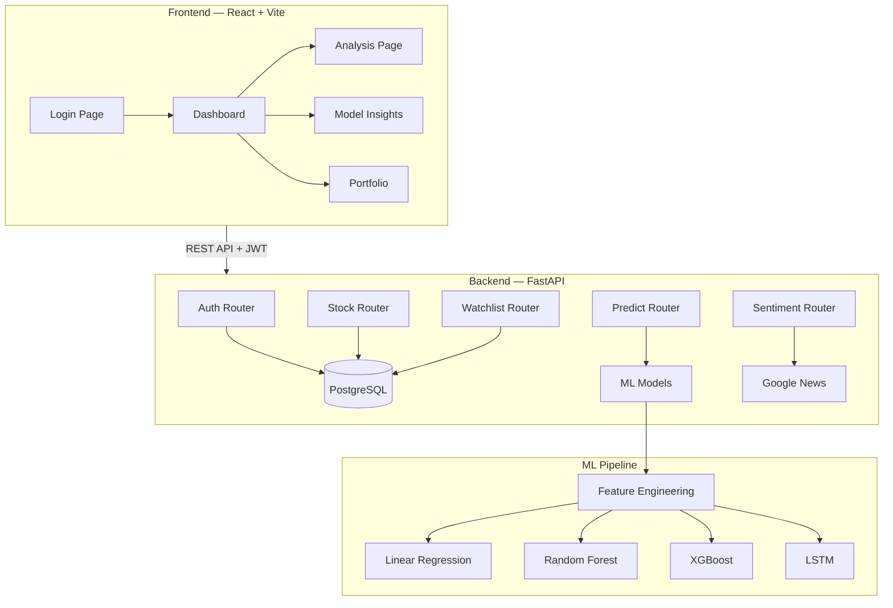

# 📈 AlphaPredict — Stock Price Predictor

A full-stack, ML-powered stock price prediction platform that compares multiple machine learning models, provides sentiment analysis, and features a modern React dashboard with technical indicators.

> **Major Project** — Built with FastAPI, React, PostgreSQL, and multi-model ML pipeline (Linear Regression, Random Forest, XGBoost, LSTM).

## ✨ Features

- 🤖 **Multi-Model ML Pipeline** — Compares Linear Regression, Random Forest, XGBoost, and LSTM; auto-selects the best model
- 📊 **37 Engineered Features** — Technical indicators (SMA, EMA, RSI, MACD, Bollinger Bands, volatility, lag features)
- 📰 **News Sentiment Analysis** — Real-time sentiment scoring using VADER NLP on Google News headlines
- 🔐 **User Authentication** — JWT-based auth with email/password registration and Google OAuth
- 💼 **Portfolio Management** — Personal watchlist and prediction history tracking
- 🎨 **Modern UI** — Dark/light theme, responsive design, Framer Motion animations
- 📈 **Interactive Charts** — Recharts-based price charts with prediction overlay and technical indicator displays
- 🔄 **Live Data Pipeline** — Fetches S&P 500 + NIFTY 500 (~1000 stocks) with incremental updates from Yahoo Finance

## 🏗️ Architecture



## 🚀 Tech Stack

| Layer | Technology |
|-------|-----------|
| **Frontend** | React 19, Vite, TailwindCSS, Recharts, Framer Motion, React Router |
| **Backend** | FastAPI, Pydantic, JWT (python-jose), bcrypt |
| **Database** | PostgreSQL (Supabase) |
| **ML Models** | scikit-learn, XGBoost, TensorFlow/Keras (LSTM) |
| **Sentiment** | NLTK VADER, Google News RSS |
| **Deployment** | Render (backend) + Vercel (frontend) |

## 📦 Project Structure

```
stock-predictor/
├── backend/
│   ├── main.py              # FastAPI app entry point
│   ├── auth.py              # JWT & bcrypt utilities
│   ├── database.py          # PostgreSQL connection pool
│   ├── helpers.py            # Yahoo Finance fetch + refresh
│   ├── models.py            # Pydantic request/response models
│   ├── sentiment.py         # VADER sentiment analysis
│   └── routers/
│       ├── auth.py          # Register, Login, Google OAuth
│       ├── stocks.py        # Stock data endpoints
│       ├── predictions.py   # ML prediction endpoint
│       ├── sentiment.py     # News sentiment endpoint
│       ├── watchlist.py     # User watchlist CRUD
│       └── internal.py      # Admin refresh endpoints
├── frontend/src/
│   ├── components/          # Navbar, StockChart, PredictionCard, SentimentPanel, etc.
│   ├── context/             # AuthContext (JWT state management)
│   ├── pages/               # Dashboard, Analysis, ModelInsights, Portfolio, Login
│   └── lib/                 # Axios API client
├── ml_model/
│   ├── train.py             # Multi-model training pipeline
│   ├── feature_engineering.py # 37 technical indicators
│   ├── lstm_model.py        # LSTM deep learning model
│   ├── model_comparison.py  # Chart generation for report
│   └── results/             # Comparison outputs (CSV + charts)
├── data_pipeline/
│   ├── fetch_data.py        # S&P 500 + NIFTY 500 data fetcher
│   └── db_setup.sql         # Database schema
├── tests/                   # Unit tests (pytest)
├── docs/                    # Architecture & model analysis docs
└── README.md
```

## 🛠️ Local Development Setup

### Prerequisites
- Python 3.11+
- Node.js 18+
- PostgreSQL (or Supabase account)

### Backend Setup

```bash
# Clone and setup
git clone https://github.com/your-username/stock-predictor.git
cd stock-predictor

# Virtual environment
python -m venv venv
source venv/bin/activate  # macOS/Linux

# Install dependencies
pip install -r backend/requirements.txt

# Configure environment
cp .env.example .env
# Edit .env with your DATABASE_URL and SECRET_KEY

# Setup database
# Run data_pipeline/db_setup.sql on your PostgreSQL instance

# Fetch stock data
python data_pipeline/fetch_data.py

# Train ML models
python ml_model/train.py

# Start API server
uvicorn backend.main:app --reload
# API docs at http://127.0.0.1:8000/docs
```

### Frontend Setup

```bash
cd frontend
npm install
npm run dev
# Frontend at http://localhost:5173
```

## 📖 API Endpoints

| Method | Endpoint | Auth | Description |
|--------|----------|------|-------------|
| POST | `/api/auth/register` | No | Register new user |
| POST | `/api/auth/login` | No | Login, get JWT token |
| POST | `/api/auth/google` | No | Google OAuth login |
| GET | `/api/auth/me` | Yes | Get current user |
| GET | `/api/stocks/{symbol}` | No | Get stock price history |
| GET | `/api/live/{symbol}` | No | Get latest price |
| GET | `/api/symbols` | No | List all symbols |
| POST | `/api/predict` | No | Predict next-day close |
| GET | `/api/model-info` | No | Model comparison results |
| GET | `/api/sentiment/{symbol}` | No | News sentiment analysis |
| GET | `/api/watchlist` | Yes | Get user watchlist |
| POST | `/api/watchlist` | Yes | Add to watchlist |
| DELETE | `/api/watchlist/{symbol}` | Yes | Remove from watchlist |
| GET | `/health/db` | No | Database health check |

## 🧪 Testing

```bash
# Run all tests
python -m pytest tests/ -v

# Run specific test module
python -m pytest tests/test_feature_engineering.py -v
```

## 📊 Model Performance

Models are trained on historical data with 37 engineered features using time-series aware splitting (70/15/15).

Run `python ml_model/train.py` to see the comparison table with metrics:
- **R²** — Coefficient of determination
- **MAE** — Mean Absolute Error
- **RMSE** — Root Mean Squared Error
- **MAPE** — Mean Absolute Percentage Error
- **Directional Accuracy** — Correct up/down prediction rate

Generate charts for your report:
```bash
python ml_model/model_comparison.py
# Charts saved to ml_model/results/
```

## 🌐 Deployment

### Backend (Render)
- Build: `pip install -r backend/requirements.txt`
- Start: `uvicorn backend.main:app --host 0.0.0.0 --port $PORT`
- Env vars: `DATABASE_URL`, `SECRET_KEY`, `GOOGLE_CLIENT_ID`

### Frontend (Vercel)
- Framework: Vite
- Root: `frontend`
- Env: `VITE_API_BASE=https://your-api.onrender.com`

## 📝 License

MIT License — see [LICENSE](LICENSE)

## 📧 Contact

**Pranjal Kumar Verma**

---

Made with ❤️ by Pranjal Kumar Verma