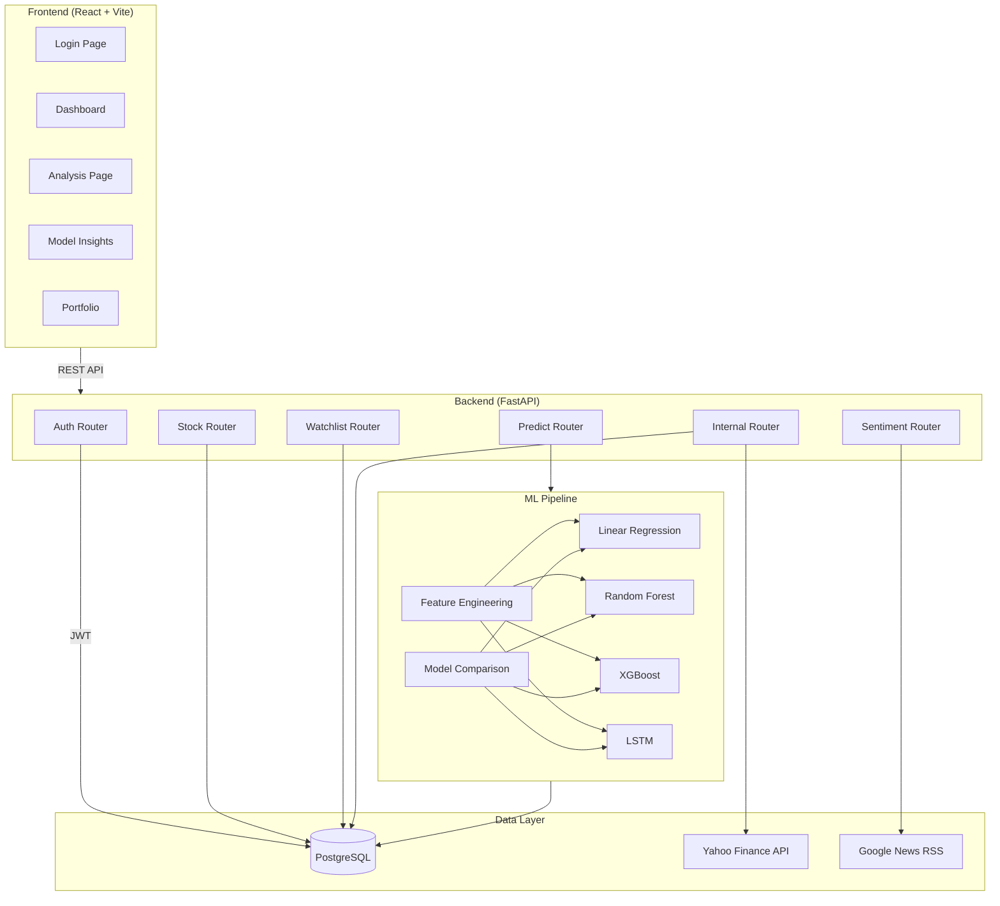
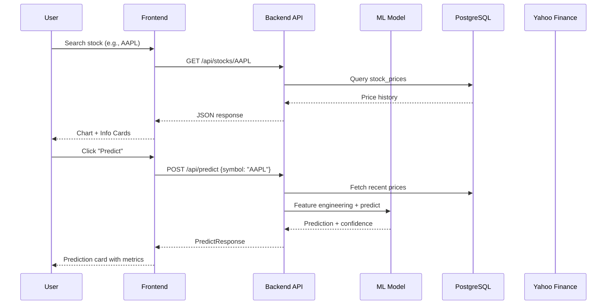

# System Architecture

## High-Level Architecture



## Data Flow



## Directory Structure

```
stock-predictor/
├── backend/
│   ├── main.py              # FastAPI app entry point
│   ├── auth.py              # JWT & password utilities
│   ├── database.py          # Connection pool management
│   ├── helpers.py           # Yahoo Finance fetch + refresh logic
│   ├── models.py            # Pydantic request/response models
│   ├── sentiment.py         # News sentiment analysis (VADER)
│   └── routers/
│       ├── auth.py          # /api/auth/* endpoints
│       ├── stocks.py        # /api/stocks/* endpoints
│       ├── predictions.py   # /api/predict endpoint
│       ├── sentiment.py     # /api/sentiment/* endpoint
│       ├── watchlist.py     # /api/watchlist/* endpoints
│       └── internal.py      # /internal/* admin endpoints
├── frontend/
│   └── src/
│       ├── components/      # Reusable UI components
│       ├── context/         # React contexts (Auth)
│       ├── pages/           # Route pages
│       └── lib/             # API client
├── ml_model/
│   ├── train.py             # Multi-model training pipeline
│   ├── feature_engineering.py # Technical indicators
│   ├── lstm_model.py        # LSTM deep learning model
│   ├── model_comparison.py  # Chart generation
│   └── results/             # Comparison outputs
├── data_pipeline/
│   ├── fetch_data.py        # S&P 500 + NIFTY 500 data fetcher
│   └── db_setup.sql         # Database schema
├── tests/                   # Unit tests
└── docs/                    # Documentation
```

## Technology Justification

| Technology | Purpose | Why Chosen |
|-----------|---------|------------|
| FastAPI | Backend API | Async support, auto-docs, Pydantic validation, modern Python |
| React + Vite | Frontend | Component-based UI, fast HMR, rich ecosystem |
| PostgreSQL | Database | ACID compliance, time-series queries, Supabase hosting |
| scikit-learn | ML (classical) | Industry standard, well-documented, multiple algorithms |
| XGBoost | ML (gradient boosting) | State-of-the-art for tabular data, feature importance |
| TensorFlow/Keras | ML (deep learning) | LSTM for sequential data, GPU acceleration |
| VADER | Sentiment analysis | Pre-trained for social media/financial text, no API key |
| JWT + bcrypt | Authentication | Stateless auth, secure password hashing |
